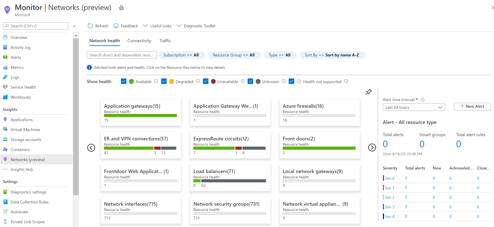
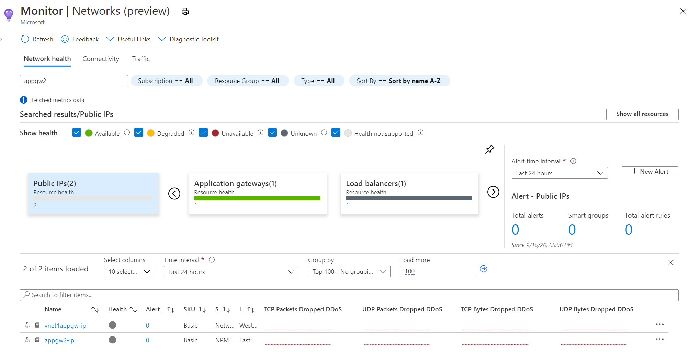
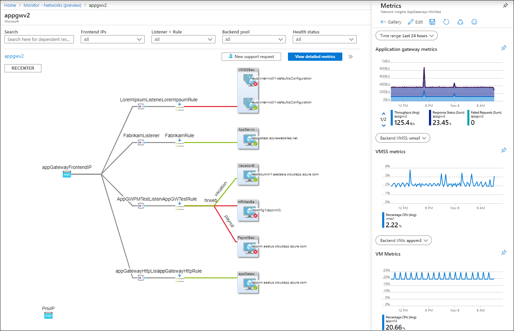
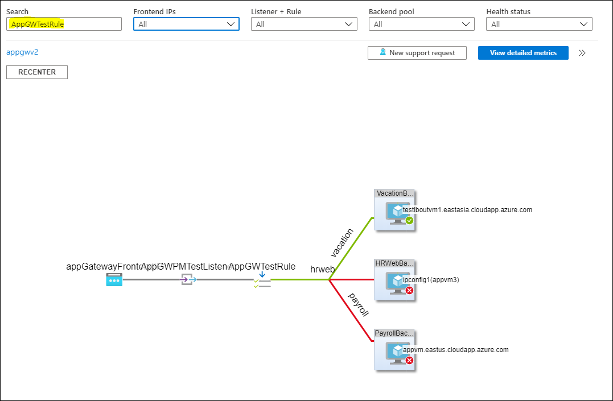
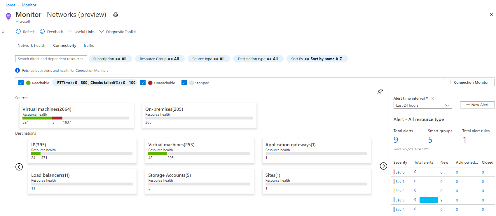
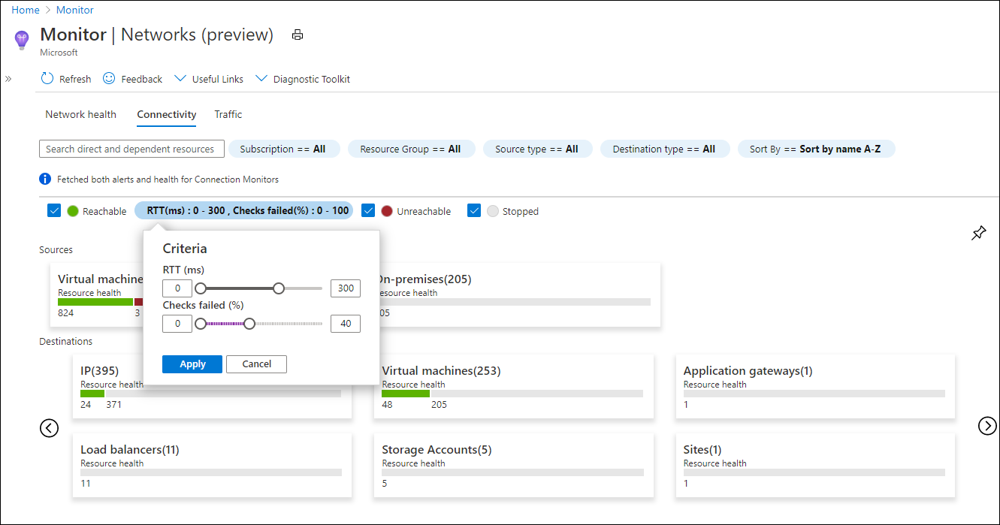
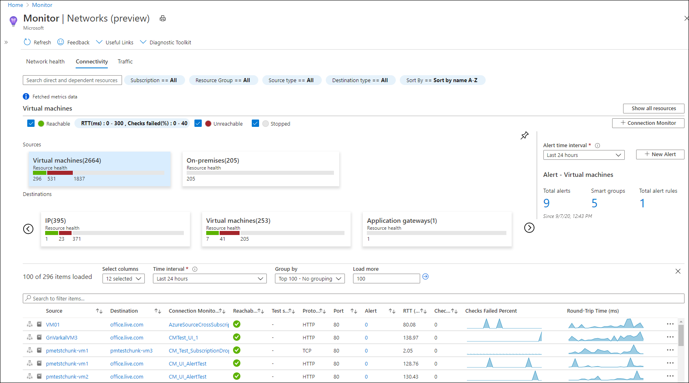
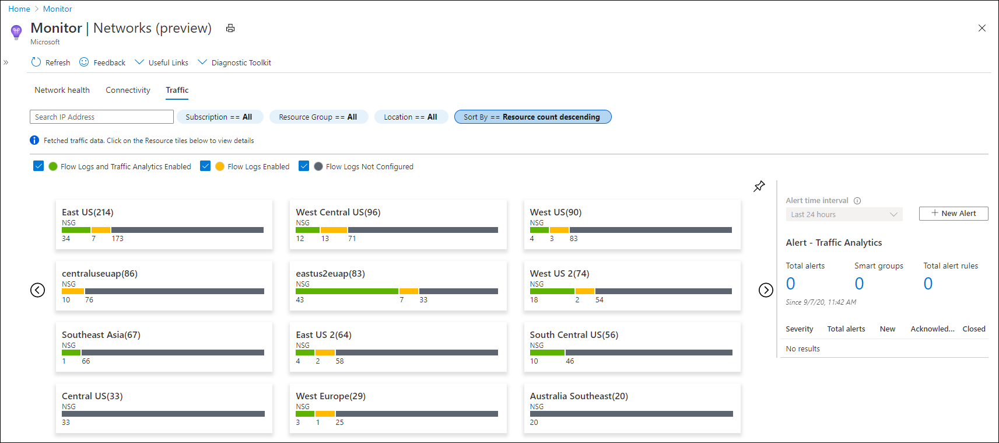
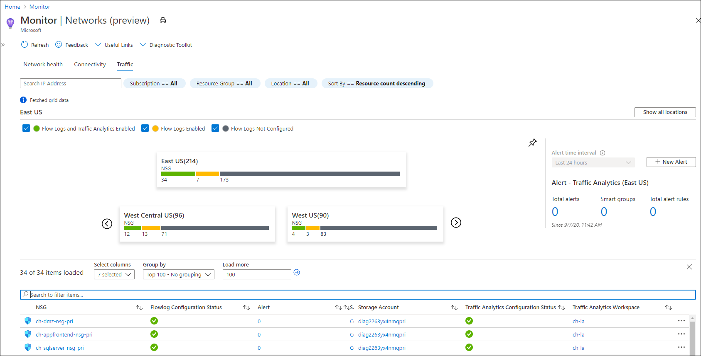
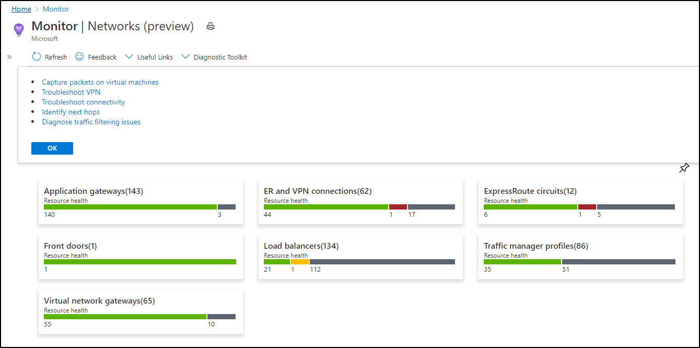

# Azure Monitor for Networks (Preview)
Azure Monitor for Network provides a comprehensive view of [health](../../service-health/resource-health-checks-resource-types.md) and [metrics](../platform/metrics-supported.md) for all deployed network resource without any configuration.  It also provides access to all network monitoring capabilities such as [Connection Monitor](../../network-watcher/connection-monitor-preview.md), [flow logging for network security groups (NSGs)](../../network-watcher/network-watcher-nsg-flow-logging-overview.md), [Traffic Analytics](../../network-watcher/traffic-analytics.md), and other network [diagnostic](../../network-watcher/network-watcher-monitoring-overview.md#diagnostics) features.

Azure Monitor for Networks is structured around the following key components of monitoring:
- [Network health and metrics](#networkhealth)
- [Connectivity](#connectivity)
- [Traffic](#traffic)
- [Diagnostic Toolkit](#diagnostictoolkit)

## Network Health and metrics

The Azure Monitor for Networks **Overview** page provides an effortless way to visualize the inventory of your networking resources along with resource health and alerts. It is divided into four key functional areas - Search and filtering, Resource Health and Metrics, Alerts. and Dependency view

### Search and filtering
The resource health and alerts view can be customized using filters like **Subscription**, **Resource Group** and **Resource Type**. The search box provides the capability to search through resource properties.

The search box can be used to search for resources and associated resources. For example, a Public IP is associated to an Application Gateway. Searching for the Public IPs DNS name will identify both Public IP and the associated Application Gateway.

### Resource Health and Metric
Each tile represents a resource type, with the number of instances deployed across all subscriptions selected along with resource health status. In the example below, there are 45 ER and VPN Connections deployed, 44 are healthy, and 1 unavailable.

Clicking on the Unavailable ER and VPN connections, launches a metric view. 

You can click on each element in the grid view. Click on the Health icon to redirect to resource health for that connection. Click on Alerts to redirect to alerts and metrics page respectively for that connection. 

### Alerts
The **Alerts** grid on the right provides a view of all the alerts generated for the selected resources across all subscriptions. Click on the alert counts to navigate to detailed alerts page.

### Dependency view
The **Dependency** view helps visualize how the resource is configured. Currently dependency view is now supported for Application Gateway, Virtual WAN, and Load Balancer. For example, in the case of Application Gateway, Dependency view can be accessed by clicking on the Application Gateway resource name from the metrics grid view. This also applies to Virtual WAN and Load Balancer.

The **Dependency** view for Application Gateway provides a simplified view of how the front-end IPs are connected to the listeners, rules and backend pool. The connecting edges are color coded and provide additional details based on the backend pool health. The view also provides a detailed view of Application Gateway metrics and metrics for all related backend pools such as virtual machine scale set and VM instances.

The dependency graph enables easy navigation to configuration settings. Right-click on a backend pool to access to other functionality. For example, if the backend pool is a VM, you can directly access VM Insights and Network Watcher connection troubleshoot to identify connectivity issues.

The search and filter bar on the dependency view provide an effortless way to search through the graph. For example, searching for *AppGWTestRule* in the example below will narrow down the graphical view to all nodes connected via *AppGWTestRule*.

Different filters provide help to narrow down on to a specific path and state. For example, select only *Unhealthy* from the **Health Status** drop down to show all the edges where state is *Unhealthy*.

Click on **Detailed Metric View** to launch a pre-configured workbook with detailed metrics for the Application Gateway, all backend pool resources and front end IPs. 

## Connectivity

The **Connectivity** tab provides an effortless way to visualize all tests configured using Connection Monitor and [Connection Monitor (Preview)](../../network-watcher/connection-monitor-preview.md) for the selected set of subscriptions.

Tests are grouped by Sources and Destinations tiles and display the reachability status for each test. Reachable settings provide an easy access to configure your reachability criteria based on Checks failed (%) and RTT (ms). Once the values are set the status for each test is updated based on the selection criteria.

Clicking on any source or destination tile launches a metric view.

You can click on each element in the grid view. Click on **Reachability** icon to redirect to the **Connection Monitor** portal page to view the hop by hop topology and connectivity impacting issues identified. Click on **Alerts** to redirect to alerts and **Checks Failed Percent/Round-Trip Time** to redirect to metrics page for the selected Connection Monitor.

The **Alerts** grid on the right provides a view of all the alerts generated for the connectivity tests configured across all subscriptions. Click on the alert counts to navigate to detailed alerts page.

## Traffic
Traffic tab provides access to all NSGs configured for [NSG Flow logs](../../network-watcher/network-watcher-nsg-flow-logging-overview.md) and [Traffic Analytics](../../network-watcher/traffic-analytics.md) for the selected set of subscriptions and grouped by locations. The search functionality provided on this tab enables identifying the NSGs configured for the searched IP address. You can search for any IP address in your environment and the tiled regional view will display all NSGs along with the NSG Flow logs and Traffic analytics configuration status.

Clicking on any region tile launches a grid view that provides easy to view and configure NSG flow logs and Traffic Analytics.  

You can click on each element in the grid view. Click on configuration status to edit the NSG flow log and Traffic Analytics configuration. Click on alerts to redirect to the Traffic Alerts configured for the selected NSG. Similarly, you can navigate to the Traffic Analytics view by clicking on the Workspace.  

The **Alerts** grid on the right provides a view of all the Traffic Analytics workspace based alerts across all subscriptions. Click on the alert counts to navigate to detailed alerts page.

##  Diagnostic toolkit
Diagnostic Toolkit provides access to all Diagnostic features available for troubleshooting the network. From this dropdown you get can access to features such as [Packet Capture](../../network-watcher/network-watcher-packet-capture-overview.md), [VPN Troubleshoot](../../network-watcher/network-watcher-troubleshoot-overview.md), [Connection Troubleshoot](../../network-watcher/network-watcher-connectivity-overview.md), [Next Hop](../../network-watcher/network-watcher-next-hop-overview.md) and [IP Flow Verify](../../network-watcher/network-watcher-ip-flow-verify-overview.md).

## Troubleshooting 

For general troubleshooting guidance, refer to the dedicated workbook-based insights [troubleshooting article](troubleshoot-workbooks.md).

This section will help you with the diagnosis and troubleshooting of some of the common issues you may encounter when using Azure Monitor for Networks. Use the list below to locate the information relevant to your specific issue.

### Resolving performance issues or failures

To help troubleshoot any networking related issues you identify with Azure Monitor for Networks, see the troubleshooting documentation of the malfunctioning resource. 
Trouble-shooting links for high used services are listed below.
* Virtual Network (VNET)
* Application Gateway
* VPN Gateway
* ExpressRoute 
* Load Balancer 

### Why don't I see the resources from all the subscriptions I have selected

Network Insights can only show resources from 5 subscriptions at a time. 

### I want to make changes or add additional visualizations to Network Insights, how do I do so

To make changes, select the "Edit Mode" to modify the workbook, then you can save your work as a new workbook that is tied to a designated subscription and resource group.

### What is the time-grain once we pin any part of the Workbooks

We utilize the "Auto" time grain, therefore it depends on what time range is selected.

### What is the time range when any part of the workbook is pinned

The time range will depend on the dashboard settings.

### What if I want to see other data or make my own visualizations? How can I make changes to the Network Insights

You can edit the workbook you see in any side-panel and detailed metric view, through the use of the edit mode, and then save your work as a new workbook that will have all your new changes.

## Next steps

- Learn more about network monitoring at [What is Azure Network Watcher?](../../network-watcher/network-watcher-monitoring-overview.md).
- Learn the scenarios workbooks are designed to support, how to author new and customize existing reports, and more by reviewing [Create interactive reports with Azure Monitor workbooks](../platform/workbooks-overview.md).