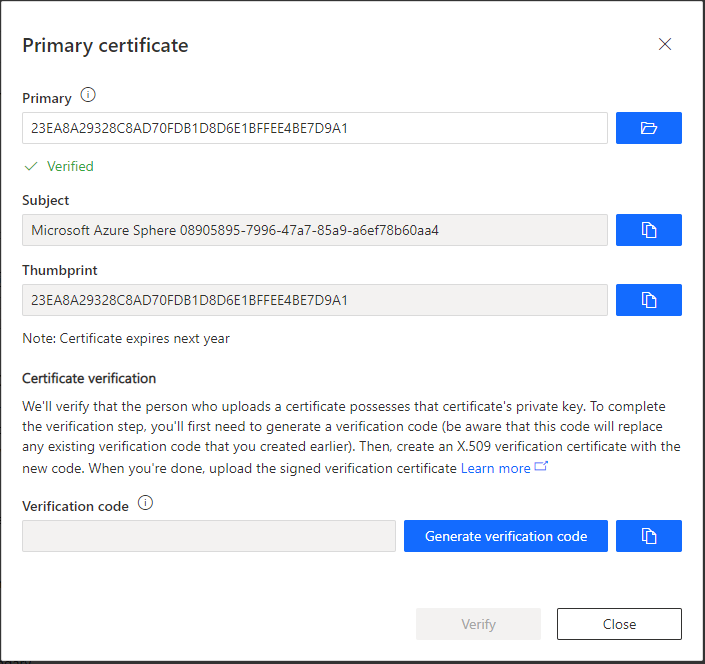
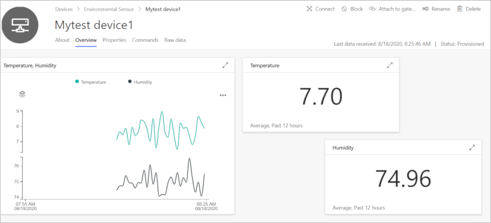
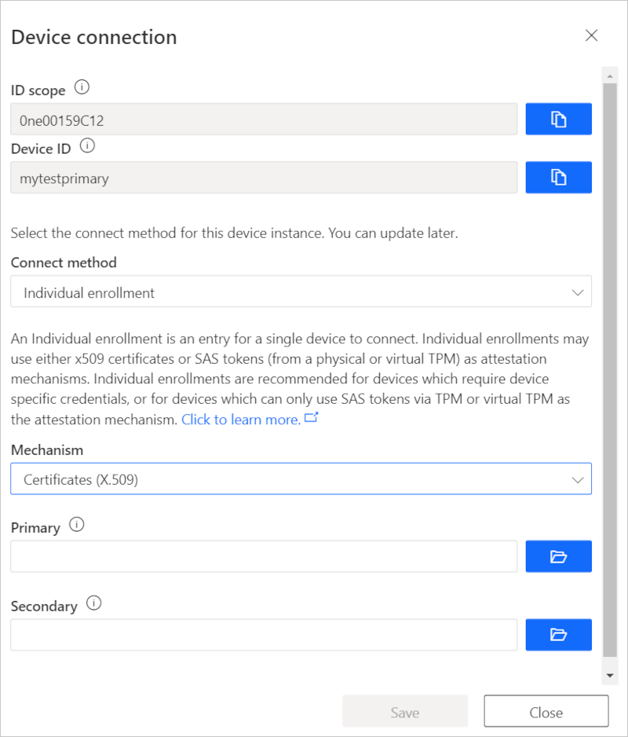
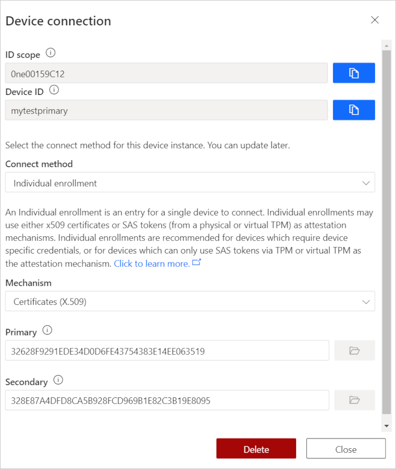
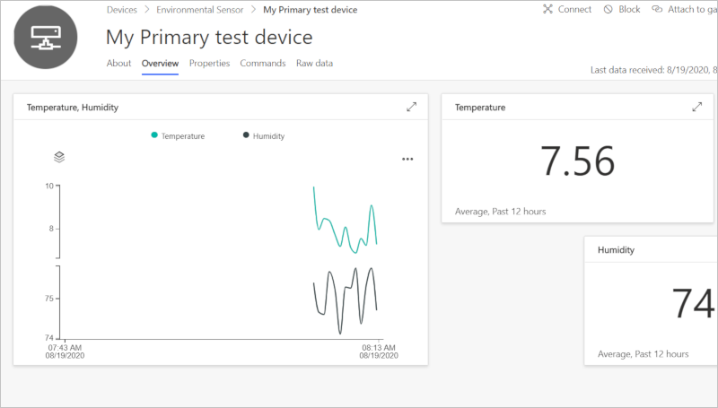

# How to connect devices with X.509 certificates using Node.js device SDK for IoT Central Application

IoT Central supports both shared access signatures (SAS) and X.509 certificates to secure the communication between a device and your application. The [Create and connect a client application to your Azure IoT Central application](./tutorial-connect-device-nodejs.md) tutorial uses SAS. In this article, you learn how to modify the code sample to use X.509.  X.509 certificates are recommended in production environments. For more information, see [Get connected to Azure IoT Central](./concepts-get-connected.md).

This article shows two ways of using X.509 - [group enrollments](how-to-connect-devices-x509.md#use-a-group-enrollment) typically used in a production environment, and [individual enrollments](how-to-connect-devices-x509.md#use-an-individual-enrollment) useful for testing.

## Prerequisites

- Completion of [Create and connect a client application to your Azure IoT Central application (Node.js)](./tutorial-connect-device-nodejs.md) tutorial.
- [Git](https://git-scm.com/download/).
- Download and install [OpenSSL](https://www.openssl.org/). If you're using Windows, you can use the binaries from the [OpenSSL page on SourceForge](https://sourceforge.net/projects/openssl/).

## Use a group enrollment

Use X.509 certificates with a group enrollment in a production environment. In a group enrollment, you add a root or intermediate X.509 certificate to your IoT Central application. Devices with leaf certificates derived from the root or intermediate certificate can connect to your application.

## Generate root and device cert

In this section, you use an X.509 certificate to connect a device with a cert derived from the enrollment group's cert, which can connect to your IoT Central application.

> [!WARNING]
> This way of generating X.509 certs is for testing only. For a production environment you should use your official, secure mechanism for certificate generation.

1. Open a command prompt. Clone the GitHub repository for the certificate generation scripts:

    ```cmd/sh
    git clone https://github.com/Azure/azure-iot-sdk-node.git
    ```

1. Navigate to the certificate generator script and install the required packages:

    ```cmd/sh
    cd azure-iot-sdk-node/provisioning/tools
    npm install
    ```

1. Create a root certificate and then derive a device certificate by running the script. Be sure to only use lower-case alphanumerics and hyphens for certificate name:

    ```cmd/sh
    node create_test_cert.js root mytestrootcert
    node create_test_cert.js device mytestdevice mytestrootcert
    ```

These commands produce three files each for the root and the device certificate

filename | contents
-------- | --------
\<name\>_cert.pem | The public portion of the X509 certificate
\<name\>_key.pem | The private key for the X509 certificate
\<name\>_fullchain.pem | The entire keychain for the X509 certificate.

## Create a group enrollment

1. Open your IoT Central application and navigate to **Administration**  in the left pane and select **Device connection**.

1. Select **+ Create enrollment group**, and create a new enrollment group called _MyX509Group_ with an attestation type of **Certificates (X.509)**.

1. Open the enrollment group you created and select **Manage Primary**.

1. Select file option and upload the root certificate file called _mytestrootcert_cert.pem_ that you generated previously:

    

1. To complete the verification, generate the verification code, copy it, and then use it to create an X.509 verification certificate at the command prompt:

    ```cmd/sh
    node create_test_cert.js verification --ca mytestrootcert_cert.pem --key mytestrootcert_key.pem --nonce  {verification-code}
    ```

1. Upload the signed verification certificate _verification_cert.pem_ to complete the verification:

    

You can now connect devices that have an X.509 certificate derived from this primary root certificate. After you save the enrollment group, make a note of the ID Scope.

## Run sample device code

1. In the Azure IoT Central application, select **Devices**, and create a new device with _mytestdevice_ as the **Device ID** from the **Environmental Sensor** device template.

1. Copy the _mytestdevice_key.pem_ and _mytestdevice_cert.pem_ files to the folder that contains the _environmentalSensor.js_ application. You created this application when you completed the [Connect a device (Node.js) tutorial](./tutorial-connect-device-nodejs.md).

1. Navigate to folder that contains the environmentalSensor.js application and run the following command to install the X.509 package:

    ```cmd/sh
    npm install azure-iot-security-x509 --save
    ```

1. Edit the **environmentalSensor.js** file.
    - Replace the `idScope` value with the **ID Scope** you made a note of previously.
    - Replace `registrationId` value with `mytestdevice`.

1. Edit the `require` statements as follows:

    ```javascript
    var iotHubTransport = require('azure-iot-device-mqtt').Mqtt;
    var Client = require('azure-iot-device').Client;
    var Message = require('azure-iot-device').Message;
    var ProvisioningTransport = require('azure-iot-provisioning-device-mqtt').Mqtt;
    var ProvisioningDeviceClient = require('azure-iot-provisioning-device').ProvisioningDeviceClient;
    var fs = require('fs');
    var X509Security = require('azure-iot-security-x509').X509Security;
    ```

1. Edit the section that creates the client as follows:

    ```javascript
    var provisioningHost = 'global.azure-devices-provisioning.net';
    var deviceCert = {
      cert: fs.readFileSync('mytestdevice_cert.pem').toString(),
      key: fs.readFileSync('mytestdevice_key.pem').toString()
    };
    var provisioningSecurityClient = new X509Security(registrationId, deviceCert);
    var provisioningClient = ProvisioningDeviceClient.create(provisioningHost, idScope, new ProvisioningTransport(), provisioningSecurityClient);
    var hubClient;
    ```

1. Modify the section that opens the connection as follows:

   ```javascript
    var connectionString = 'HostName=' + result.assignedHub + ';DeviceId=' + result.deviceId + ';x509=true';
    hubClient = Client.fromConnectionString(connectionString, iotHubTransport);
    hubClient.setOptions(deviceCert);
    ```

1. Execute the script and verify the device was provisioned successfully:

    ```cmd/sh
    node environmentalSensor.js
    ```

    You can also verify that telemetry appears on the dashboard.

    

## Use an individual enrollment

Use X.509 certificates with an individual enrollment to test your device and solution. In an individual enrollment, there's no root or intermediate X.509 certificate in your IoT Central application. Devices use a self-signed X.509 certificate to connect to your application.

## Generate self-signed device cert

In this section, you use a self-signed X.509 certificate to connect devices for individual enrollment, which are used to enroll a single device. Self-signed certificates are for testing only.

Create a self-signed X.509 device certificate by running the script. Be sure to only use lower-case alphanumerics and hyphens for certificate name:

  ```cmd/sh
    cd azure-iot-sdk-node/provisioning/tools
    node create_test_cert.js device mytestselfcertprimary
    node create_test_cert.js device mytestselfcertsecondary 
  ```

## Create individual enrollment

1. In the Azure IoT Central application, select **Devices**, and create a new device with **Device ID** as _mytestselfcertprimary_ from the Environmental Sensor device template. Make a note of the **ID Scope**, you use it later.

1. Open the device you created and select **Connect**.

1. Select **Individual Enrollments** as the **Connect Method** and **Certificates (X.509)** as the mechanism:

    

1. Select file option under primary and upload the certificate file called _mytestselfcertprimary_cert.pem_ that you generated previously.

1. Select the file option for the secondary certificate and upload the certificate file called _mytestselfcertsecondary_cert.pem._ Then select **Save**:

    

The device is now provisioned with X.509 certificate.

## Run a sample individual enrollment device

1. Copy the _mytestselfcertprimary_key.pem_ and _mytestselfcertprimary_cert.pem_ files to the folder that contains the environmentalSensor.js application. You created this application when you completed the [Connect a device (Node.js) tutorial](./tutorial-connect-device-nodejs.md).

1. Edit the **environmentalSensor.js** file as follows and save it.
    - Replace the `idScope` value with the **ID Scope** you made a note of previously.
    - Replace `registrationId` value with `mytestselfcertprimary`.
    - Replace **var deviceCert** as:

        ```javascript
        var deviceCert = {
        cert: fs.readFileSync('mytestselfcertprimary_cert.pem').toString(),
        key: fs.readFileSync('mytestselfcertprimary_key.pem').toString()
        };
        ```

1. Execute the script and verify the device was provisioned successfully:

    ```cmd/sh
    node environmentalSensor.js
    ```

    You can also verify that telemetry appears on the dashboard.

    

You can repeat the above steps for _mytestselfcertsecondary_ certificate as well.

## Next steps

Now that you've learned how to connect devices using  X.509 certificates, the suggested next step is to learn how to [Monitor device connectivity using Azure CLI](howto-monitor-devices-azure-cli.md)
